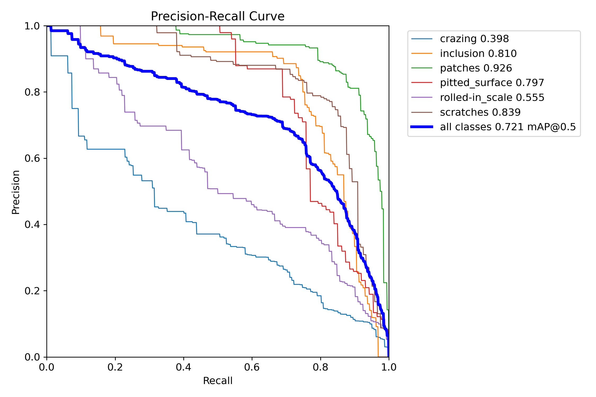
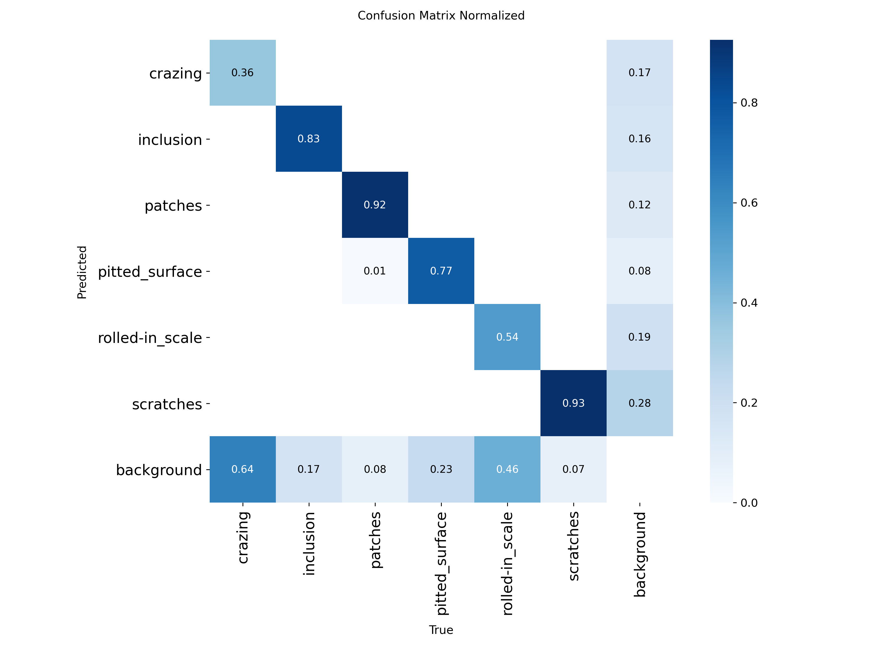
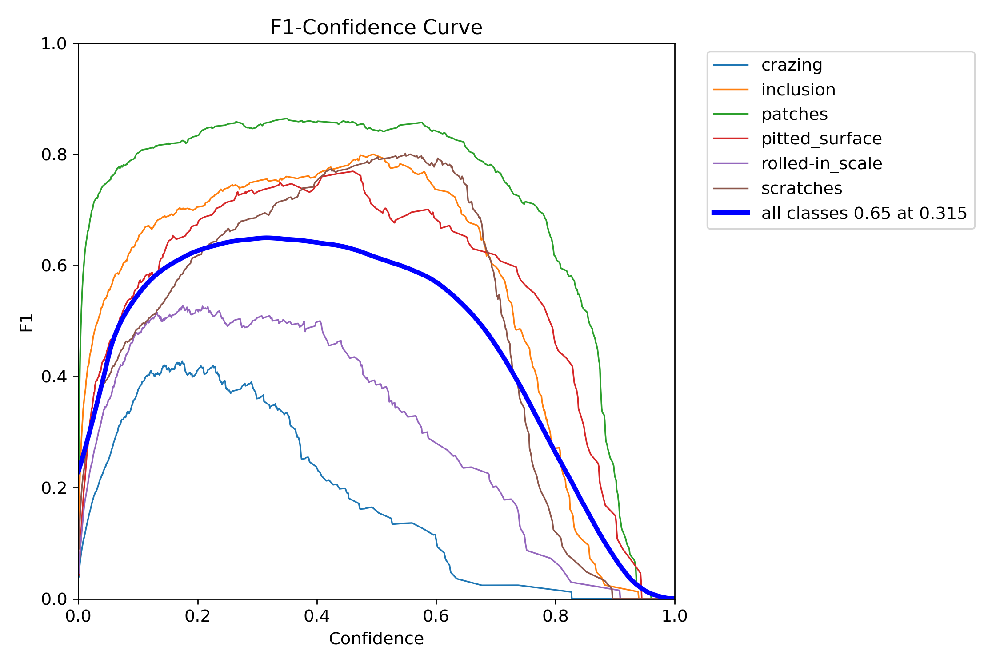
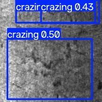
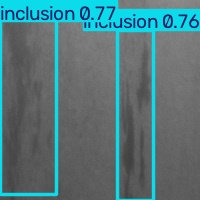
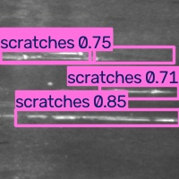

# Surface Defect Detection Using Computer Vision

Computer vision project focused on detecting surface defects in steel images using object detection models.

The project explores the complete workflow of a small-scale computer vision experiment: dataset inspection, annotation preprocessing, visual validation, model training, evaluation, inference, and failure analysis.

The main goal was not only to train a detector, but also to understand how dataset characteristics and defect appearance affect model performance.

---

## Dataset

The experiments use the **NEU Surface Defect Database (NEU-DET)**.

The dataset contains six categories of steel surface defects:

- Crazing
- Inclusion
- Patches
- Pitted surface
- Rolled-in scale
- Scratches

The original images are 200 × 200 pixels and the annotations are provided in XML format.

Before training, the dataset was inspected and converted to the YOLO annotation format.

During preprocessing, one validation annotation (`crazing_240.xml`) was found without a corresponding image and was skipped automatically.

After preprocessing:

| Split | Images |
|---|---:|
| Train | 1,439 |
| Validation | 360 |

The training split contained 3,332 annotated objects and the validation split contained 854 annotated objects.

---

## Project Workflow

The project was developed incrementally following this pipeline:

```text
Dataset download
        ↓
Dataset inspection
        ↓
VOC annotation parsing
        ↓
YOLO annotation conversion
        ↓
Annotation visualization
        ↓
Model training
        ↓
Model evaluation
        ↓
Failure analysis
        ↓
Inference
````

Special attention was given to inspecting the data before training and checking whether the converted bounding boxes were visually correct.

---

## Project Structure

```text
.
├── configs/
│   ├── dataset.yaml
│   ├── neu_det_yolo.yaml
│   └── experiment.yaml
│
├── scripts/
│   ├── prepare_dataset.py
│   ├── download_data.py
│   ├── audit_dataset.py
│   ├── voc_to_yolo.py
│   ├── visualize_annotations.py
│   ├── train.py
│   ├── evaluate.py
│   ├── run_experiments.py
│   ├── analyze_failures.py
│   └── predict.py
│
├── assets/
│   ├── confusion_matrix_normalized.png
│   ├── pr_curve.png
│   ├── f1_curve.png
│   ├── prediction_crazing.jpg
│   ├── prediction_inclusion.jpg
│   └── prediction_scratches.jpg
│
├── README.md
├── requirements.txt
└── .gitignore
```

Generated datasets, training runs, model weights, and temporary results are excluded from version control.

---

## Installation

Clone the repository:

```bash
git clone https://github.com/Skeletus/computer-vision-defect-detection.git
cd computer-vision-defect-detection
```

Install the dependencies:

```bash
pip install -r requirements.txt
```

---

## Dataset Preparation

### 1. Initialize directories

```bash
python scripts/prepare_dataset.py
```

### 2. Download NEU-DET

```bash
python scripts/download_data.py
```

### 3. Inspect the original dataset

```bash
python scripts/audit_dataset.py
```

The audit checks basic properties such as:

* number of images
* number of annotations
* image dimensions
* class distribution
* corrupted images
* invalid XML annotations

### 4. Convert VOC annotations to YOLO

```bash
python scripts/voc_to_yolo.py
```

The processed dataset is generated under:

```text
data/processed/NEU-DET/
├── train/
│   ├── images/
│   └── labels/
└── validation/
    ├── images/
    └── labels/
```

---

## Annotation Inspection

Before training, random samples were visualized to confirm that the XML-to-YOLO conversion preserved the location and class of the bounding boxes.

```bash
python scripts/visualize_annotations.py --samples 10
```

Validation samples can also be inspected:

```bash
python scripts/visualize_annotations.py \
  --split validation \
  --samples 10
```

This step was useful for identifying overlapping annotations and large bounding boxes present in the original dataset.

---

## Model Training

The first experiments used **YOLOv8n** with transfer learning from pretrained weights.

Training parameters are stored separately in:

```text
configs/experiment.yaml
```

An extended training run used:

```yaml
epochs: 100
patience: 25
batch: 64
imgsz: 320
seed: 0
```

Training can be started with:

```bash
python scripts/train.py
```

GPU training was performed using a Tesla T4 environment.

---

## Evaluation

The trained model can be evaluated with:

```bash
python scripts/evaluate.py \
  --weights path/to/best.pt \
  --device 0
```

One baseline evaluation produced:

| Metric    | Result |
| --------- | -----: |
| Precision | 0.6635 |
| Recall    | 0.6667 |
| mAP@50    | 0.7210 |
| mAP@50-95 | 0.3882 |

The extended 100-epoch YOLOv8n experiment improved the results to approximately:

| Metric    | Result |
| --------- | -----: |
| Precision |  0.717 |
| Recall    |  0.669 |
| mAP@50    |  0.736 |
| mAP@50-95 |  0.394 |

The improvement was relatively small, suggesting that simply increasing the number of epochs was not enough to solve the harder classes.

---

## Performance by Defect Type

The baseline evaluation showed substantial differences between defect categories.

| Class           | mAP@50-95 |
| --------------- | --------: |
| Patches         |    0.5757 |
| Pitted surface  |    0.4547 |
| Inclusion       |    0.4535 |
| Scratches       |    0.4340 |
| Rolled-in scale |    0.2456 |
| Crazing         |    0.1657 |

`patches` was the easiest category for the model, while `crazing` was considerably more difficult.

The precision-recall curves showed the same pattern: visually distinctive defects such as patches and scratches were easier to detect than lower-contrast texture defects.

---

## Precision-Recall Analysis



The model achieved an overall mAP@0.5 of approximately **0.72** in the baseline evaluation.

The strongest category was `patches`, while `crazing` had the weakest precision-recall behavior.

---

## Confusion Matrix



The normalized confusion matrix highlights an important limitation of the detector.

Several `crazing` and `rolled-in scale` instances were classified as background rather than being detected as objects.

In contrast, categories such as `patches`, `scratches`, and `inclusion` showed much stronger detection rates.

---

## Confidence Analysis



The best global F1 score in the baseline experiment was approximately **0.65** around a confidence threshold of **0.315**.

The curves also show that using a very high confidence threshold substantially reduces recall.

---

## Prediction Examples

### Crazing



Crazing was one of the most difficult categories. Predictions often had moderate confidence and the texture boundaries were less visually defined.

### Inclusion



Inclusion defects produced more stable predictions, with confidence values around 0.7–0.8 in several validation samples.

### Scratches



Scratches were generally detected with relatively high confidence because of their distinctive elongated structure.

---

## Failure Analysis

A separate failure-analysis script was implemented to inspect predictions below a configurable confidence threshold.

```bash
python scripts/analyze_failures.py \
  --weights path/to/best.pt \
  --device 0
```

Instead of looking only at aggregate metrics, the analysis was used to inspect difficult samples and identify recurring patterns.

The main observations were:

* `crazing` frequently produced low-confidence detections.
* `rolled-in scale` also showed weaker localization and recall.
* Defects with more distinctive shapes, such as patches and scratches, were generally easier to detect.
* Some images contained overlapping or multiple annotations.
* Some predictions were assigned to visually similar defect categories.
* Increasing the training duration improved the overall metrics only slightly.

These observations suggest that the main limitation is not simply training time. Image resolution, annotation consistency, visual similarity between defects, and model capacity are also relevant factors.

---

## Inference

Predictions can be generated for a single image:

```bash
python scripts/predict.py \
  --weights path/to/best.pt \
  --source path/to/image.jpg
```

or for an entire directory:

```bash
python scripts/predict.py \
  --weights path/to/best.pt \
  --source path/to/images/
```

The inference script outputs:

* detected class
* confidence score
* bounding box coordinates
* annotated output image

A validation inference run used:

```text
Images: 360
Image size: 640
Confidence threshold: 0.25
```

---

## Experiments

The project also includes support for running an experiment matrix across different model sizes and input resolutions.

The configurations considered include:

```text
YOLOv8n @ 320
YOLOv8n @ 640
YOLOv8s @ 320
YOLOv8s @ 640
```

This was motivated by the hypothesis that increasing the input resolution could help with small or low-contrast defects such as `crazing` and `rolled-in scale`.

A YOLOv8s experiment at 640-pixel input resolution achieved approximately:

```text
Precision:   0.716
Recall:      0.685
mAP@50:      0.744
mAP@50-95:   0.386
```

The higher-resolution and larger-model configuration improved mAP@50 slightly, but did not produce a corresponding improvement in mAP@50-95.

This indicates that increasing model capacity and input resolution alone did not completely solve the localization difficulty.

---

## What Did Not Work Well

One of the main findings of the project was that additional training did not improve all defect categories equally.

Initially, I expected a longer training run and higher-resolution experiments to produce a large improvement. Instead, the overall improvement was limited.

The most difficult categories remained `crazing` and `rolled-in scale`.

Their appearance is mainly characterized by subtle texture variations rather than strongly defined object boundaries. This makes their localization more ambiguous than defects such as scratches or patches.

This result motivated the failure-analysis stage instead of continuing to increase training epochs without inspecting the underlying errors.

---

## Possible Improvements

Future experiments could explore:

* data augmentation targeted at low-contrast defects
* higher-resolution training with optimized batch sizes
* additional YOLO architectures
* class-specific error analysis
* annotation consistency analysis
* alternative detection or segmentation approaches
* hard-example mining
* comparison between object detection and image segmentation

For texture-based defects such as crazing, segmentation may be particularly interesting because the boundaries of the defect are not always naturally represented by rectangular bounding boxes.

---

## Technologies

* Python
* PyTorch
* Ultralytics YOLO
* OpenCV
* NumPy
* Pandas
* Pillow
* Matplotlib
* PyYAML
* Git

---

## Conclusion

This project provided a practical exploration of an object detection pipeline applied to industrial surface inspection.

The main takeaway was that model training is only one part of the problem.

Inspecting annotations, understanding class characteristics, validating preprocessing, analyzing difficult samples, and studying model failures were equally important for understanding the final performance.

The experiments showed that visually distinctive defects can be detected reliably with a relatively small YOLO model, while subtle texture-based defects remain significantly more challenging.